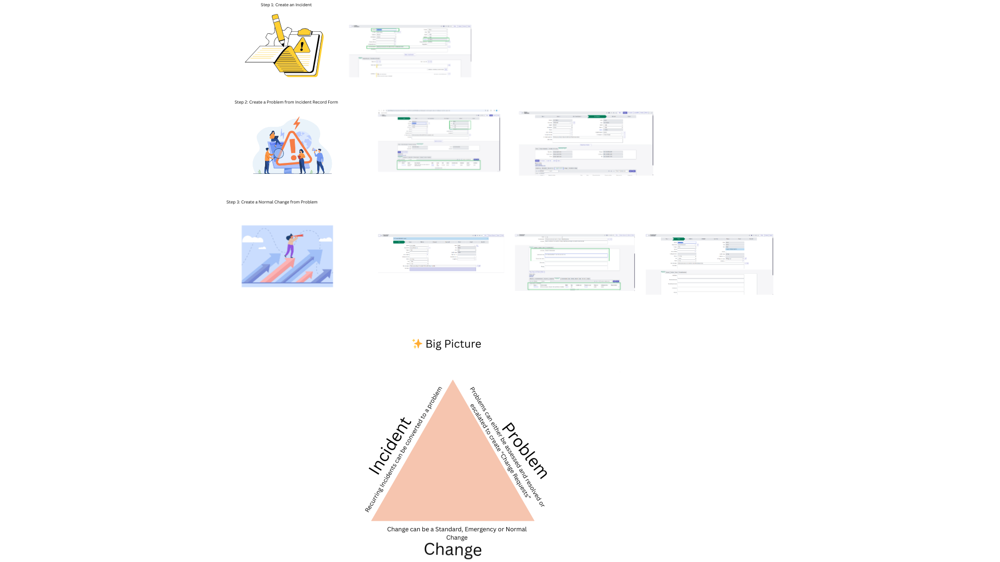
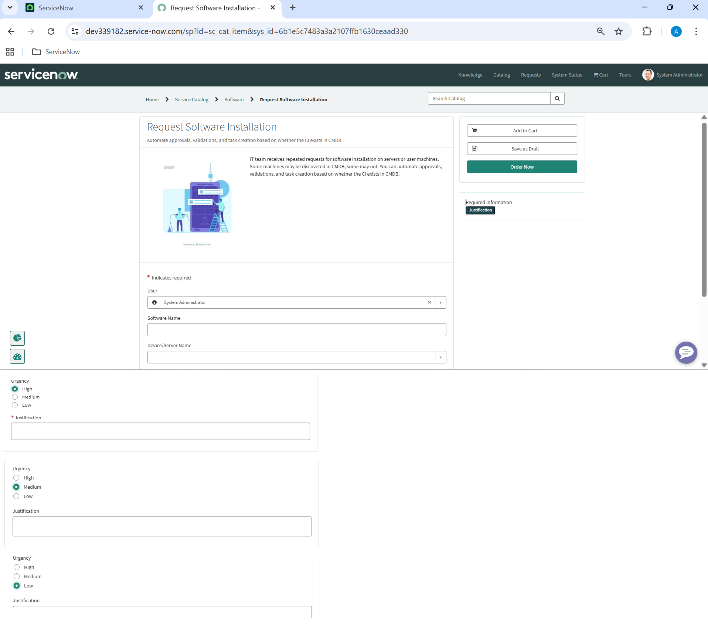
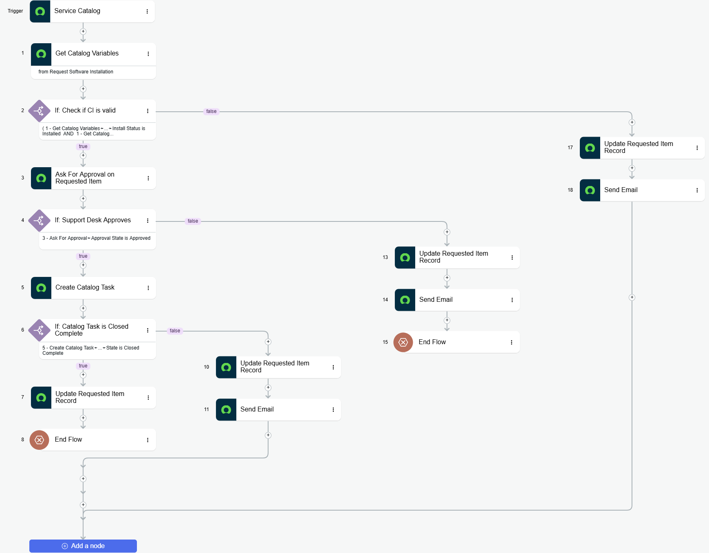

# ITSM Core Module Implementation

This project demonstrates my understanding of how Incidents, Problems, and Changes are related in ServiceNow, as well as my ability to create and use Flows to automatically generate a Problem record from Incidents and automate catalog item requests with CI validation.

---

## 🖼️ Images

- Incident Problem Change Relationships  
  

- Custom Script Action  
  

- Create Problem From Incident Flow  
  

- New Catalog Item  
  

- Catalog Item Flow  
  

---

## Flow Designer Automation

Extend the out-of-the-box workflow by automating with Flow Designer.

### Flow 1: Auto-Create Problem

- **Trigger**: When more than 5 Incidents are created:

  - On the same CI within 24 hours
  - OR with the same Category and Sub-Category

- **Action**: Auto-create Problem

### Flow 2: Auto-Create Change from Problem

- **Trigger**: When a Problem state changes to **Root Cause Identified**

- **Action**: Auto-create Change request

### Flow 3: Auto-Process Software Installation Requests with CI Check

- **Catalog Item Name**: **Software Installation Request**
- **Category**: **IT Services > Software Requests**

- **Flow Name**: Auto-Process Software Installation Requests

#### Trigger

When a new **Software Installation Request** is submitted.

#### Actions

1. **Check if CI exists**
   - The flow queries the CMDB to see if the requested CI is discoverable.
2. **Conditional Branch**
   - **If CI exists** → create a task to process the software installation.
   - **If CI does not exist** → notify the IT team or take an alternative action.

#### Benefits

- Ensures software requests are tied to valid CIs.
- Reduces errors and manual verification.
- Provides automated notifications and task creation based on CI availability.

#### Screenshot Idea

- Show the Catalog Item form submitted by a user.
- Show the flow canvas highlighting the CI check and task creation logic.

---

## 📚 Summary

- Manual processes demonstrate clear record relationships.
- Automation with Flow Designer reduces manual clicks and repetitive tasks.
- Great for **training demos, GitHub workflows, and ServiceNow showcase projects**.
