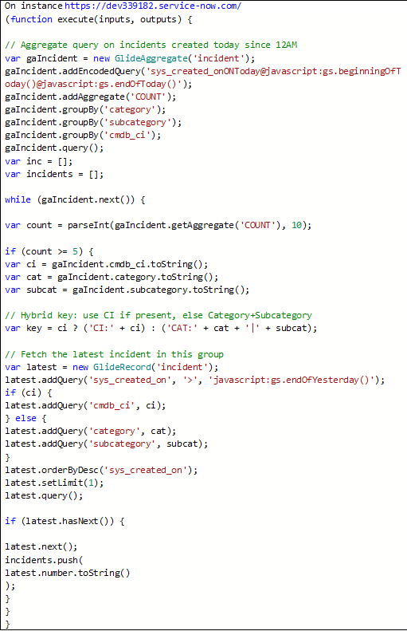
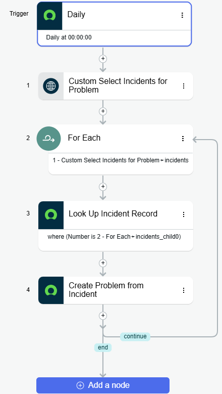

# ITSM Core Module Implementation

This project demonstrates my understanding of how Incidents, Problems, and Changes are related in ServiceNow, as well as my ability to create and use Flows to automatically generate a Problem record from Incidents and automate catalog item requests with CI validation.

---

## 🖼️ Images

- Incident Problem Change Relationships  
  

- Custom Script Action  
  

- Create Problem From Incident Flow  
  

- New Catalog Item  
  

- Catalog Item Flow  
  

---

## Flow Designer Automation

Extend the out-of-the-box workflow by automating with Flow Designer.

### Flow 1: Auto-Create Problem

- **Trigger**: Scheduled once a day
- Script checks if more than 5 Incidents are created:

  - On the same CI within 24 hours
  - OR with the same Category and Sub-Category

- **Action**: Auto-create Problem

### Flow 2: Auto-Process Software Installation Requests with CI Check

- **Catalog Item Name**: **Software Installation Request**
- **Category**: **IT Services > Software Requests**

- **Flow Name**: Auto-Process Software Installation Requests

#### Trigger

- When a new **Software Installation Request** is submitted.

#### Actions

- Action 1: Check if the selected CI has installed status ‘Installed’, Operational Status is ‘Operational’ and Warranty expiration is empty or greater than today’s date
  o If yes: Continue processing.
  o If not: Notify IT team or create a task for CMDB reconciliation.
- Action 2: Auto-create Request Task for software installation.
- Action 3: Request approval from software admin.
- Action 4: Notify the requester once the task is assigned / completed.

#### Benefits

- Ensures software requests are tied to valid CIs.
- Reduces errors and manual verification.
- Provides automated notifications and task creation based on CI availability.

#### Screenshot Idea

- Show the Catalog Item form submitted by a user.
- Show the flow canvas highlighting the CI check and task creation logic.

---

## 📚 Summary

- Manual processes demonstrate clear record relationships.
- Automation with Flow Designer reduces manual clicks and repetitive tasks.
- Great for **training demos, GitHub workflows, and ServiceNow showcase projects**.
